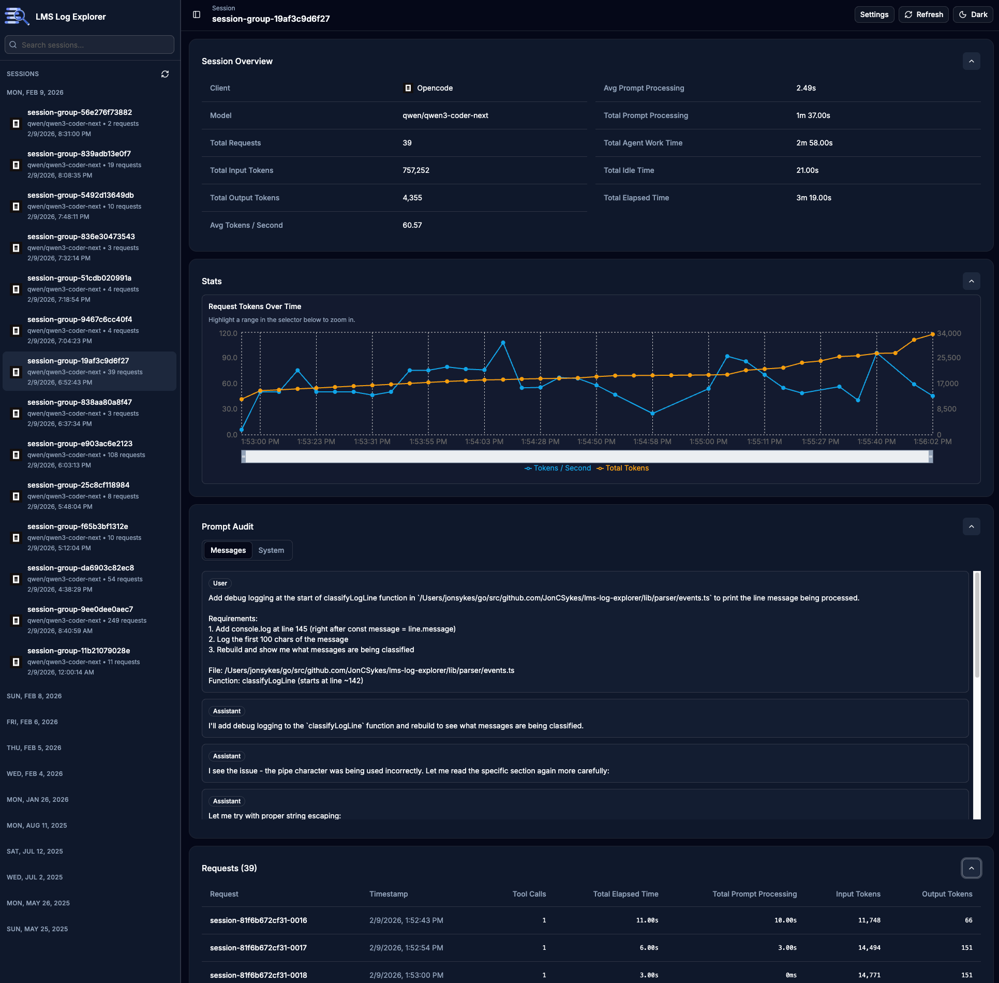
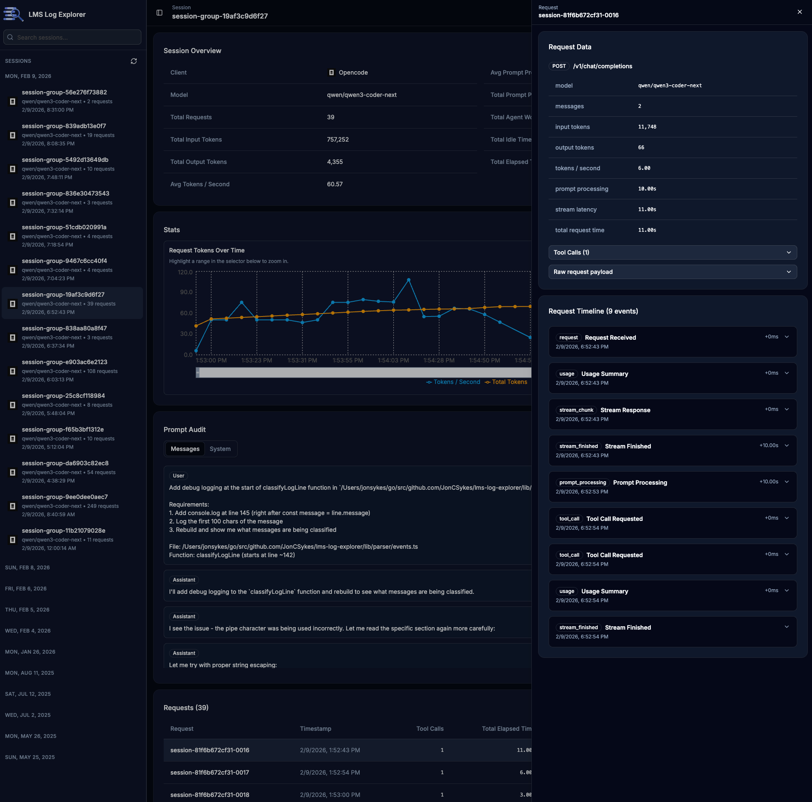

<h1 align="center">
  
  LMS Log Explorer
</h1>
<h3 align="center">
Web UI for exploring LM Studio server logs with session grouping, request timelines,
token/latency metrics, and tool-call visibility.
</h3>

---

LMS Log Explorer scans LM Studio server logs (for example:
`~/.lmstudio/server-logs/2026-02/*.log`), parses request and stream events, and
builds a searchable dashboard focused on:

- Session groups and requests (sidebar + request table)
- Request timeline and raw request payloads
- Tool calls (merged from streaming deltas)
- Usage and performance metrics (tokens, latency, prompt processing)
- Prompt audit views (system and conversation content)
- Optional AI-generated session names

The app runs fully local by default. The only external calls are optional AI
provider calls when Session Renamer is enabled.

<p align="center">
  
  
</p>

## Features

- Session-first dashboard with grouped requests
- Date-grouped searchable sidebar
- Request drawer with detailed timeline
- Prompt Audit tabbed view (messages + system)
- Stats chart for request tokens/sec and total tokens over time
- Incremental indexer with persistent SQLite cache
- Background indexing with live progress overlay
- Docker Compose support for local deployment
- Unit/integration tests (Vitest) + UI tests (Playwright)

## How It Works

1. Log discovery:
LM Studio log files are found under `LMS_LOG_ROOT` (default:
`~/.lmstudio/server-logs`), grouped by month folders.

2. Parsing pipeline:
`lib/parser` reads lines, reconstructs multiline JSON, classifies events
(`request_received`, `prompt_processing`, `stream_packet`, `stream_finished`),
and aggregates tool-call deltas.

3. Session correlation:
requests and stream packets are linked into request sessions with strict
request anchoring.

4. Indexing:
`lib/indexer` builds/refreshes an index and persists sessions + file metadata
in SQLite (`LMS_INDEX_DB_PATH`), then serves list/detail views.

5. UI:
the Next.js app (`app/page.tsx`) polls indexing status, renders grouped
sessions, and fetches details via API routes.

## Tech Stack

- Next.js App Router + TypeScript
- Tailwind + shadcn/ui
- better-sqlite3 (local persistent cache)
- Vitest (unit/integration), Playwright (E2E)
- Optional Genkit integrations for session renaming

## Prerequisites

- Node.js 20+
- pnpm (Corepack is fine: `corepack enable`)
- LM Studio logs available locally
- Optional: Docker Desktop (for Compose workflow)

## Local Development

### 1) Install dependencies

```bash
pnpm install
```

### 2) Configure local environment

Create `.env.local` in repo root:

```bash
cat > .env.local <<'EOF'
# Path to LM Studio logs on your machine
LMS_LOG_ROOT=~/.lmstudio/server-logs

# Optional: custom SQLite location (default shown)
LMS_INDEX_DB_PATH=~/.lms-log-explorer/index.sqlite

# Optional: enable debug endpoint and extra indexer logs
DEBUG=false

# Optional AI provider tokens (used only if session renamer is enabled)
# OPENAI_API_KEY=
# ANTHROPIC_API_KEY=
# GEMINI_API_KEY=
# GOOGLE_API_KEY=
EOF
```

### 3) Start dev server

```bash
pnpm dev
```

Open: `http://localhost:3000`

### 4) Build and run production mode locally (optional)

```bash
pnpm build
pnpm start
```

## Docker Compose

### 1) Prepare `.env` for Compose

Use the tracked template:

```bash
cp .env.example .env
```

Then edit `.env`:

```env
LMS_LOG_ROOT_HOST=/absolute/path/to/.lmstudio/server-logs
LMS_LOG_EXPLORER_PORT=3000
NODE_MAX_OLD_SPACE_SIZE=4096
```

### 2) Build and run

```bash
docker compose up --build
```

Open: `http://localhost:${LMS_LOG_EXPLORER_PORT}`

### 3) Stop

```bash
docker compose down
```

### 4) Reset containerized index DB (fresh re-index)

```bash
pnpm db:reset:docker
```

## Configuration Reference

### App/runtime environment variables

| Variable | Default | Used by | Description |
|---|---|---|---|
| `LMS_LOG_ROOT` | `~/.lmstudio/server-logs` | app/indexer | Root folder for LM Studio logs (local dev/runtime). |
| `LMS_INDEX_DB_PATH` | `~/.lms-log-explorer/index.sqlite` | app/indexer | SQLite index file path. |
| `DEBUG` | `false` | app/indexer + debug API | Enables debug logging and `/api/debug/index`. |
| `NEXT_DIST_DIR` | `.next` | Next.js | Build output directory override (used by tests). |

### Compose-specific variables (`.env`)

| Variable | Default | Description |
|---|---|---|
| `LMS_LOG_ROOT_HOST` | `./lms-logs` | Host path bind-mounted into container as `/logs`. |
| `LMS_LOG_EXPLORER_PORT` | `3000` | Published container port. |
| `NODE_MAX_OLD_SPACE_SIZE` | `4096` | Node heap size in MB to reduce startup OOM risk on large indexes. |

### AI session renamer variables (optional)

| Variable | Description |
|---|---|
| `OPENAI_API_KEY` | Used when provider is OpenAI. |
| `ANTHROPIC_API_KEY` | Used when provider is Anthropic. |
| `GEMINI_API_KEY` / `GOOGLE_API_KEY` | Used when provider is Google. |

## NPM Scripts

| Script | Purpose |
|---|---|
| `pnpm dev` | Run Next.js in development mode. |
| `pnpm build` | Production build. |
| `pnpm start` | Run production server. |
| `pnpm test` | Unit/integration tests (alias of `test:unit`). |
| `pnpm test:unit` | Run Vitest suite. |
| `pnpm test:integration` | Run parser/indexer integration subset. |
| `pnpm test:e2e` | Run Playwright E2E tests. |
| `pnpm test:e2e:headed` | Playwright headed mode. |
| `pnpm test:e2e:install` | Install Playwright browser. |
| `pnpm lint` | ESLint checks. |
| `pnpm lint:fix` | Auto-fix lint issues where possible. |
| `pnpm type-check` | TypeScript compile checks. |
| `pnpm format` | Prettier write. |
| `pnpm format:check` | Prettier check only. |
| `pnpm db:reset` | Remove local SQLite index (`.sqlite`, `-wal`, `-shm`). |
| `pnpm db:reset:docker` | Stop compose stack and remove volumes. |

## API Endpoints

| Route | Method | Purpose |
|---|---|---|
| `/api/index` | `GET` | Returns index readiness and indexing status. |
| `/api/index?force=1` | `POST` | Schedules index rebuild (forced reparse). |
| `/api/sessions` | `GET` | Paginated session list (`limit`, `offset`, optional `q`). |
| `/api/sessions/chatId` | `GET` | Session detail by `sessionId` or `chatId` query param. |
| `/api/settings` | `GET/POST` | AI session renamer settings. |
| `/api/session-renamer/run` | `POST` | Runs AI session renamer job. |
| `/api/debug/index` | `GET` | Debug summary (only when `DEBUG=true`). |

## UI Overview

- Sidebar:
search + date groups + session groups.
- Main content:
Session Overview, Stats, Prompt Audit, Requests table.
- Request Drawer:
Request Data, Tool Calls, Request Timeline.
- Indexing overlay:
progress and current file while indexing runs.

## Troubleshooting

### Log directory not found

- Verify `LMS_LOG_ROOT` (local) or `LMS_LOG_ROOT_HOST` (Compose).
- Ensure LM Studio has produced server logs in month subfolders like `YYYY-MM`.

### Docker OOM at startup/index hydration

- Increase heap in `.env`:
`NODE_MAX_OLD_SPACE_SIZE=6144` (or higher).
- Reset stale DB volume and retry:
`pnpm db:reset:docker && docker compose up --build`.

### Fresh-load testing (clear cached index)

- Local: `pnpm db:reset`
- Compose: `pnpm db:reset:docker`

### Debug index status

- Set `DEBUG=true` and restart app.
- Open `/api/debug/index` to inspect summary + sample sessions.

## Repository Structure

```text
app/                   Next.js pages + API routes
components/            UI components (including sidebar/timeline)
lib/parser/            Log parsing pipeline
lib/indexer/           Index build + SQLite persistence
lib/hooks/             Client hooks for sessions/details
types/                 Shared TypeScript types
e2e/                   Playwright tests
fixtures/              Parser/indexer fixture logs
docs/                  Spec, roadmap, parser notes
```

## Notes

- This app is intended for local/dev usage.
- It does not send logs externally unless AI session renamer is enabled and used.
